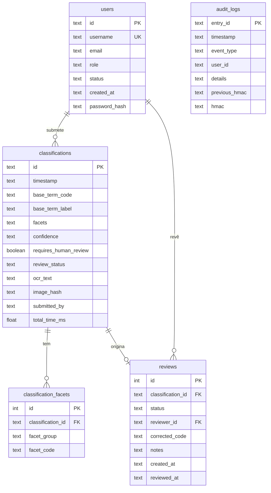

# IDRISK2 — Esquema da base de dados

Base de dados relacional (PostgreSQL/Supabase) que suporta o fluxo completo da
aplicação: utilizadores com controlo de acesso por papel (RBAC), classificações
FoodEx2, facetas normalizadas, revisão humana (human-in-the-loop) e o registo de
auditoria à prova de adulteração exigido pelo EU AI Act.

## Diagrama de entidades e relações

## Tabelas

**users** — utilizadores do sistema e o seu papel (inspector, supervisor,
administrator, auditor). Alimenta o ecrã de administração e, no futuro, a
autenticação real (`password_hash` está reservado para isso).

**classifications** — uma linha por classificação FoodEx2 produzida pelo
pipeline. Guarda o termo base, a confiança, o texto OCR, o hash SHA-256 da
imagem (a imagem em si é descartada por minimização GDPR) e quem submeteu.
É a tabela que alimenta o ecrã *Results History*.

**classification_facets** — as facetas FoodEx2 (F01, F04, …) **normalizadas**,
uma linha por faceta, ligadas à classificação. Permite consultas relacionais
(ex.: "quantas classificações usam a faceta de processamento F28?") em vez de
ter tudo dentro de um campo JSON.

**reviews** — a fila e as decisões de revisão humana. Quando a confiança é
baixa/média, a classificação é sinalizada e entra aqui como `pending`; um
supervisor pode `approved`/`rejected`, registar `corrected_code` e notas.
Alimenta o *Supervisor Dashboard*.

**audit_logs** — o registo de auditoria encadeado por HMAC (cada entrada inclui
o HMAC da anterior), tornando qualquer adulteração detetável — requisito de
rastreabilidade do EU AI Act para sistemas de IA de alto risco.

## Relações
- Um **utilizador** submete muitas **classificações** (`submitted_by`).
- Uma **classificação** tem muitas **facetas** (`classification_facets`).
- Uma **classificação** origina no máximo uma **revisão** (`reviews`).
- Um **utilizador** (supervisor) revê muitas **classificações** (`reviewer_id`).

## Como adicionar ao Supabase

Há duas formas — usa **uma** delas:

### Opção A — Criação automática pela aplicação (recomendada, já implementada)
A app cria todas as tabelas no arranque (`create_all`) e popula:
- utilizadores de demonstração,
- importa as classificações antigas (`data/records/*.json`),
- importa o registo de auditoria (`data/audit/**/*.json`),
- preenche facetas e revisões a partir das classificações existentes.

Basta **reiniciar o backend** com o `DATABASE_URL`/credenciais do Supabase no
`.env`. As tabelas aparecem em **Supabase → Table Editor**.

### Opção B — SQL manual no Supabase
Se preferires criar o esquema à mão (ou versioná-lo), abre
**Supabase → SQL Editor → New query**, cola o conteúdo de [`schema.sql`](schema.sql)
e clica **Run**. Depois a app apenas insere/lê dados.

> As duas opções são compatíveis: o `create_all` da app não recria tabelas que
> já existam.
